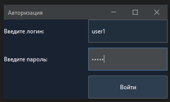
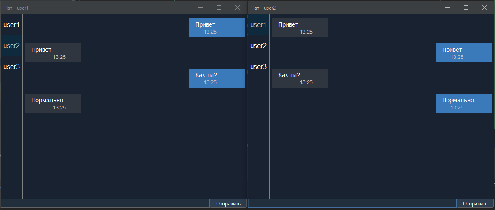

# JavaChatMVP

JavaChatMVP — это клиентское приложение для обмена текстовыми сообщениями, созданное с использованием Java AWT/Swing и FlatLaf, с интерфейсом, стилизованным под тёмную тему Telegram.

## Описание проекта

Приложение представляет собой клиент для демо-сервера, с которым оно взаимодействует для отправки и получения сообщений. Основная цель — предоставить функционал обмена текстовыми сообщениями с минималистичным интерфейсом, максимально приближённым к Telegram, но в объёме MVP.

## Функциональные возможности

- **Авторизация**: при запуске приложения требуется ввести логин и пароль. Доступен список предопределённых тестовых пользователей.
- **Отправка сообщений**: поддерживается отправка и приём сообщений в текстовом формате.
- **Тёмная тема**: интерфейс приложения стилизован под тёмную тему Telegram.
- **Минимальный набор функций**: приложение не поддерживает шифрование сообщений, уведомления о прочтении, изменение или удаление отправленных сообщений, групповые чаты, и т.д.

## Установка и запуск

### Требования
- **Java 17+**
- **FlatLaf** библиотека для оформления интерфейса

### Запуск
1. Склонируйте репозиторий на своё устройство:
    ```bash
    git clone https://github.com/DeadDad3/JavaChatMVP.git
    ```
2. Импортируйте проект в вашу среду разработки (например, IntelliJ IDEA).
3. Убедитесь, что подключена библиотека FlatLaf для корректного отображения тёмной темы.
4. Запустите сервер  через Run 'MessengerServer.main', чтобы обеспечить подключение клиента к серверу.
5. Запустите `Main` для начала работы с клиентом. Для тестирования обработки сообщений от разных пользователей запустите параллельно ещё один `Main` (если IDEA не позволяет запустить два `Main` файла одновременно, то разрешите это делать в разделе `Run - Edit Configurations`).

## Структура проекта

- **src/ru/kudukhov/ui**: содержит классы пользовательского интерфейса.
- **src/ru/kudukhov/network**: содержит классы для работы с сетью и обмена пакетами сообщений между клиентом и сервером.
- **src/ru/kudukhov/network/packets**: содержит классы пакетов для передачи данных.

## Использование

1. При запуске приложения отобразится окно авторизации, где необходимо ввести логин и пароль одного из тестовых пользователей.
    - Тестовые пользователи:
        - `user1` / `pass1`
        - `user2` / `pass2`
        - `user3` / `pass3`
2. После успешной авторизации загрузится интерфейс чата. При вводе неправильного логина или пароля возникнет ошибка и Main файл прекратит работу.
3. Выберите пользователя из списка слева для начала диалога.
4. Введите сообщение в поле ввода и нажмите "Отправить" или клавишу Enter для отправки сообщения.

## Тестовые пользователи

Предопределённые пользователи хранятся в классе `Dispatcher` и включают:

- `user1` с паролем `pass1`
- `user2` с паролем `pass2`
- `user3` с паролем `pass3`

## Примечания

- Приложение предназначено для демонстрации базового обмена сообщениями и не содержит дополнительных функций, таких как шифрование, уведомления о прочтении или сохранение истории сообщений на сервере.
- Авторизация проверяется локально через предопределённые учетные данные и не требует отдельной регистрации.

## Скриншоты

### Окно авторизации


### Окна чата разных пользователей


## Лицензия

Этот проект находится под лицензией MIT License — подробнее см. [LICENSE](LICENSE).
